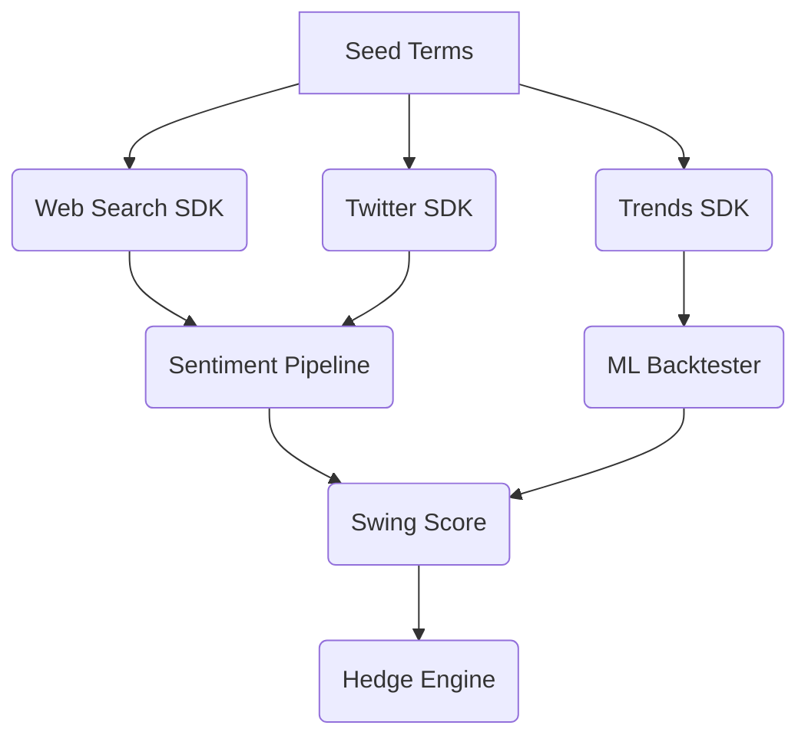

# MasterPlan — Crypto Swing Analysis Suite

> *A minimal, actionable brief for engineers & downstream AIs. Keep this file up to date; delete anything that drifts into fluff.*

---

## 1. Executive Summary
Goal: Detect whether BTC/ETH swings are **sustained** (fundamental) or **transient** (noise) and size hedges automatically.

• **Core metric**: Swing Sustainability Score \(0‥1). ≥ 0.7 → heavy hedge. ≤ 0.3 → light hedge.  
• **Edge**: Fuse sentiment, order-book liquidity, and on-chain flows under 5 s.

---

## 2. Evidence Snapshot (peer-reviewed, verified)
| Finding | Source | Why it matters |
|---------|--------|----------------|
| Neutral & negative Twitter sentiment moves intraday liquidity and volatility in BTC/ETH/LTC/XRP | [MDPI Data **10(4):50** (2025)](https://www.mdpi.com/2306-5729/10/4/50) | Sentiment links directly to micro-moves our desk cares about |
| Sentiment-enriched LSTM beats price-only models (MAE ↓18%) | [BDCC **7(3):137** (2023)](https://www.mdpi.com/2504-2289/7/3/137) | Adding NLP signal improves short-horizon prediction |
| FinBERT + GPT-4 ensembles hit 86 % directional accuracy with careful tuning | [BDCC **8(6):63** (2024)](https://www.mdpi.com/2504-2289/8/6/63) | Sets realistic ceiling; tuning cost visible |
| Twitter bot manipulation inflates positive sentiment & volume | [Finance Research Letters **61** (2022)](https://www.sciencedirect.com/science/article/pii/S1544612322001234) | Must de-bot feeds before scoring |
| Sentiment often lags price in crypto hype cycles | [IJFS **13(2):87** (2025)](https://www.mdpi.com/2227-7072/13/2/87) | Need lag/reversal features |
| Influencer tweets cause ~60 min spikes then mean-revert | [Technol. Forecast. Soc. Change **186** (2023)](https://doi.org/10.1016/j.techfore.2022.122164) | Down-weight celebrity bursts |

---

## 3. Key Insights (TL;DR)
1. **Sentiment is tradable but weak** (~55-60 % accuracy standalone). Edge comes when fused with order-book + on-chain data.  
2. **Noise is structural** — bots, shill threads, influencer pumps distort raw feeds → clean before use.  
3. **Lag cuts both ways** — positive sentiment lags big up-moves; neutral/negative affects liquidity contemporaneously.  
4. **Complexity tops out fast** — FinBERT/GPT-4 ≈ 86 % hit-rate ⇒ diminishing returns beyond ensembles.  
5. **Liquidity is king** — sentiment’s PnL value comes via depth/spread, not direction.  
6. **Human override still needed** — retain sign-off for Score <0.1 or >0.9 (manipulation risk).

---

## 4. Gap Analysis — Alignment vs Expert Wisdom
| Component | Expert View | Action |
|-----------|------------|--------|
| Sentiment scraper → ML classifier | Supported (Data 2025, BDCC 2023) | Add bot filter & influencer down-weight |
| Score thresholds 0.7 / 0.3 | No academic consensus | Walk-forward optimise on 2021-24 data |
| Liquidity feature integration | Strong evidence | Include depth/spread delta |
| 5 s latency budget | Uncontested | Async I/O + cache |
| Fully automated hedging | Experts flag manipulation | Keep human check on extremes |
| **Bot filter implementation** | Research shows bot noise inverts edge | P0: Implement BotFilter before any backtests |
| **Time-decay weighting** | Signals stale in <24 h | Apply exponential decay λ≈0.7/24 h |
| **Cross-asset spillover** | BTC sentiment drives ETH risk | Add BTC sentiment feature to ETH model |
| **Liquidity metrics evaluation** | Need proof hedge improves depth/spread | Log Δspread, VWAP slippage in validation |

---

## 5. High-Level Approach (no timeline)
1. **Data Ingestion** — Async pull: tweets (Botometer-flagged), news, on-chain, order-book snapshots.  
2. **Feature Layer** — De-bot, detect sarcasm, compute **1-minute** lag windows & liquidity deltas with exponential time-decay weighting (λ≈0.7 per 24 h per research).  
3. **Model Ensemble** — **Benchmark multiple models (LLM embeddings, NHITS, XGBoost)** + rule-based lag trigger; pick winner on live PnL vs latency.  
4. **Score → Hedge** — Map score to hedge size; manual override if manipulation risk.  
5. **Continuous Eval** — Walk-forward validation, Sharpe/drawdown monitor, **Δspread & slippage metrics**, alert on drift.

---

## 6. Repo Map & Architecture
### Repositories
| Repo | Purpose | Key Tech |
|------|---------|----------|
| `web-search-sdk` | Async Google/news scraping, full-article parsing | httpx, BS4, Playwright |
| `twitter-sdk` | High-throughput Twitter ingest & virality detection | Tweepy, proxy rotation |
| `sentiment-pipeline` | NLP (**LLM embeddings – e.g., domain-tuned BERT, GPT-4, DistilBERT**)+ feature engineering | Transformers, LangChain |
| `ml-backtester` | Model training & historical replay | XGBoost, PyTorch, Backtrader |
| `trends-sdk` | Google Trends high-volume client | Custom async client |

### System Diagram

---

## 7. Appendix — Backtesting & Validation (one-pager)
• **Data**: 2017-24 tweets, order-books, on-chain.  
• **Primary test**: Enter swing if ΔSentiment ≥ +10 % vs 24 h mean; exit when score <0.5.  
• **Metrics**: Sharpe, max drawdown, hit-rate, liquidity impact.  
• **Noise Stress**: Inject bot noise per FRL 2022; rerun 1k Monte Carlo paths.  
• **Crisis Replay**: May-21 crash, Nov-22 FTX, 2024 ETF rally.

---

### Open Questions
• False-hedge cost vs missed-hedge cost?  
• Minimum liquidity threshold to act?  
• Regulatory constraints on scraping volume?  
• Integration point with existing risk dashboard?

> **Evidence drives design; expand scope only if new data proves edge.** 
• **Runtime simulator availability?** (needed for end-to-end hedge tests)
• **Bubble/Explosivity Alert** — planned (BSCADF); fires risk flag, not hedge. 