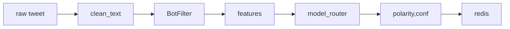

# Sentiment-Pipeline – Detailed Build Plan
*Version 0.1 — 2025-07-14*

> Goal: provide a single reference so a new developer can create a production-ready sentiment scoring service that aligns with MasterPlan and the latest research.

---
## 0  Overview
The repo will ingest tweets (and later Reddit, news), clean & filter them, generate features, score sentiment via a **tiered LLM stack**, and publish a real-time *Swing Sustainability Score* for each asset. Latency budget ≤5 s end-to-end.

---
## 1  Repo Skeleton
| Path | Purpose |
|------|---------|
| `pyproject.toml` | Python 3.11; deps: transformers, peft, torch, pydantic, pandas, redis, loguru, ruff, mypy, pytest |
| `sentiment_pipeline/__init__.py` | Top-level package, exposes `__version__`. |
| `sentiment_pipeline/schema.py` | Pydantic models (see §2). |
| `sentiment_pipeline/bot_filter.py` | P0 Botometer + heuristic filter. |
| `sentiment_pipeline/features/` | Lag, decay, liquidity, spillover utils. |
| `sentiment_pipeline/models/` | Model zoo (baseline, llama_local, gpt4_gateway, nhits, router). |
| `sentiment_pipeline/pipeline.py` | Orchestrator (async graph). |
| `configs/` | YAML configs (train, eval, realtime). |
| `scripts/` | CLI entrypoints (ingest_day, train, score_realtime). |
| `.github/workflows/ci.yaml` | Ruff → Black → pytest → mypy strict. |
| `logs/` | Dev logs (.md) committed by the dev daily. |

---
## 2  Data Schema (`schema.py`)
```python
class CleanTweet(BaseModel):
    tweet_id: str
    user_id: str
    timestamp_ms: int
    text_clean: str
    source: Literal["twitter"] = "twitter"

class Liquidity(BaseModel):
    spread_before: float  # bps
    spread_after: float
    depth1pct: float      # USD at ±1 %
    whale_tx_ct: int      # count in ±5 min window

class SentimentRecord(CleanTweet):
    polarity: float  # −1 … 1
    confidence: float  # 0 … 1
    btc_sentiment_rolling: float | None = None
    liquidity: Liquidity
    version: str  # model hash or git-SHA
```
Stores in Parquet or Postgres.

---
## 3  BotFilter (`bot_filter.py`)
*Priority 0* — must run before any back-test.

Implementation checklist:
1. Thin wrapper around `BotometerLite` (v4) with async rate-limit handler.
2. Redis cache keyed by `user_id` (TTL = 30 days).
3. Heuristic fallback if API fails (>1 s timeout):
   * default avatar
   * followers/following < 0.01
   * ≥3 duplicated tweets in 24 h
4. `is_bot(tweet_json) -> bool`  
5. Unit tests: mocked API + edge-case tweets.

---
## 4  Feature Engineering (`features/`)
| File | Function | Notes |
|------|----------|-------|
| `lag_windows.py` | `add_lag(df, cols, windows=[1m,5m,1h])` | Rolling means stds. |
| `decay.py` | `exp_decay(series, half_life='24h', freq='1m')` | λ ≈ 0.7/24 h per research. |
| `liquidity.py` | `compute_liquidity(ob_snapshot)` | Returns spread Δ & depth1pct. |
| `spillover.py` | `join_btc_sentiment(df)` | Adds BTC rolling sentiment to ETH/others. |

All helpers are pure functions → easier unit-testing.

---
## 5  Model Zoo (`models/`)
### 5.1  `baseline_lexicon.py`
VADER + emoji sentiment; ~10 µs/tweet.

### 5.2  `llama_local.py`
• Loads `HF_MODEL_DIR` (e.g., llama-3-8b-instruct) with PEFT fine-tune.  
• Quantised (bitsandbytes) for GPU/CPU split.

### 5.3  `gpt4_gateway.py`
• Calls OpenAI ChatCompletion; retries 429/500 with back-off.  
• Env var `OPENAI_API_KEY`; cost ceiling in redis (`llm_budget:$month`).

### 5.4  `nhits.py`
NHITS time-series forecaster for sentiment time-series; used in bubble alert.

### 5.5  `router.py`
Confidence routing logic: baseline → llama → GPT-4 (only if `0.4 < conf < 0.6`).

All modules implement:
```python
def predict_batch(texts: list[str]) -> tuple[np.ndarray, np.ndarray]:
    """Return polarity and confidence arrays."""
```

---
## 6  Training & Evaluation
`train.py` reads YAML config:
```yaml
model: llama_local
epochs: 3
lr: 2e-5
freeze_layers: 8
```
Outputs to `mlruns/` (MLflow). `eval.py` performs walk-forward back-test on 1-min bars; metrics:
* F1 (pos/neg) — for classification parity with literature
* MAE on polarity
* Sharpe, maxDD
* Δspread vs baseline

---
## 7  Orchestrator (`pipeline.py`)

Redis channel `sentiment:latest:{asset}` stores JSON `{score, ts}`. Hedge-engine polls or subscribes.

---
## 8  CLI Entrypoints (`scripts/`)
| Script | Example | Purpose |
|--------|---------|---------|
| `ingest_day.py` | `python -m scripts.ingest_day 2025-07-14` | Back-fill one day. |
| `train.py` | `python -m scripts.train configs/llama.yaml` | Fine-tune model. |
| `score_realtime.py` | `python -m scripts.score_realtime` | Runs orchestrator loop. |

---
## 9  CI & Quality Gates
* Ruff & Black check.  
* `pytest -q` (coverage ≥80 %).  
* `mypy --strict` (stubs allowed for Botometer & OpenAI).

---
## 10  Milestones
| ID | Deliverable | Owner | Acceptance |
|----|-------------|-------|-------------|
| SP-01 | Repo skeleton + CI green | new dev | `python -m pytest -q` passes in CI. |
| SP-02 | BotFilter v1 | new dev | 95 % bot recall on test set; 100 rps sustained. |
| SP-03 | Feature layer v0.1 | new dev | lag, decay, liquidity funcs unit-tested. |
| SP-04 | Llama model fine-tuned | you | `eval.py` shows ≥ 0.75 F1. |
| SP-05 | Router + cost quota | new dev | Monthly token spend logged ≤ budget. |
| SP-06 | End-to-end realtime scorer | new dev | Hedge-engine receives score ≤5 s after tweet. |

---
## 11  Open Questions
1. Redis vs Postgres for final score store?  
2. Botometer paid tier budget?  
3. Which PEFT-tuned checkpoint to start from — llama-3-8b-instr-v0 or mistral-7b-fin?
4. Whale-transfer data source — Glassnode vs WhaleAlert?  
5. MLflow vs Weights & Biases for experiment tracking? 